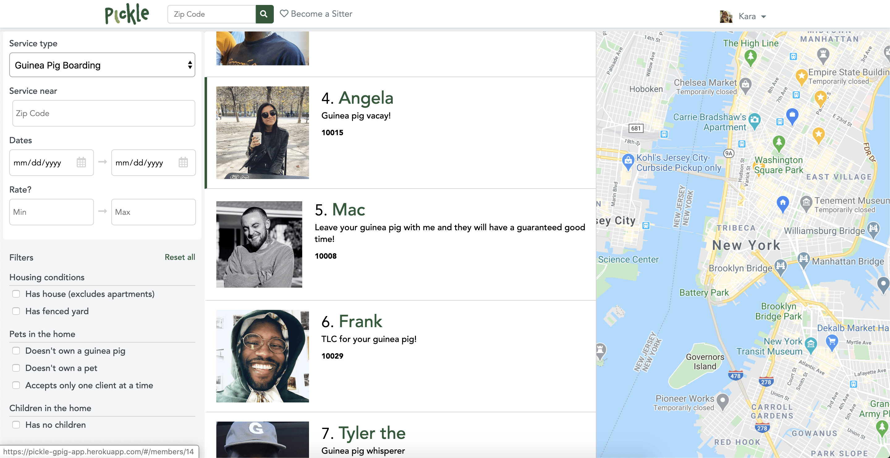

# Pickle
[**Pickle**](https://pickle-gpig-app.herokuapp.com/#/) (click for live demo), a Rover clone, is an online marketplace where users can buy and sell guinea pig services, such as boarding and grooming. After signing up, users can edit their profile information, which includes account information, profile photo, service prices, and add or remove their guinea pigs. Users can also look through all members and book services. 

## Features
### **Editing Profile**

**Users can...**
* edit account information (name, email, zipcode)
* upload a new profile photo
* update service pricing
* update their profile information (headline, about me)
* add a guinea pig, update a guinea pig's information, and remove a guinea pig

### **Booking**

**Users can...**
* look through users 
* go to other user's profile
* contact other user 
* book a service

## **Technologies**
Pickle's backend is built with Ruby on Rails and PostgreSQL. The frontend is built with Javascript, React, and Redux. Heroku was used for deployment, and AWS was used for storing assets.

### **Future Implementations**
* Search by filter, including Google Map API 
* Editing/removing bookings
* Reviews
* Messaging
